# 🏗️ Arquitectura del Sistema

Documentación técnica completa del backend SaaS. Esta guía está diseñada para que cualquier desarrollador pueda entender el proyecto sin conocimiento previo.

---

## 📑 Tabla de Contenidos

1. [Visión General](#visión-general)
2. [Stack Tecnológico](#stack-tecnológico)
3. [Arquitectura de Alto Nivel](#arquitectura-de-alto-nivel)
4. [Estructura de Capas](#estructura-de-capas)
5. [Flujo de Autenticación](#flujo-de-autenticación)
6. [Modelo de Datos](#modelo-de-datos)
7. [Multi-Tenancy](#multi-tenancy)
8. [Sistema de Billing](#sistema-de-billing)
9. [Pipeline de Middleware](#pipeline-de-middleware)
10. [WebSockets y Broadcasting](#websockets-y-broadcasting)
11. [Task Queue Asíncrona](#task-queue-asíncrona)
12. [Storage y Media](#storage-y-media)
13. [Deployment Architecture](#deployment-architecture)
14. [Observabilidad](#observabilidad)

---

## 🎯 Visión General

Este proyecto es un **backend SaaS modular** construido como un monolito bien estructurado. Está diseñado para ser:

- **Reutilizable**: Template base para cualquier proyecto SaaS
- **Multi-tenant**: Aislamiento completo de datos entre organizaciones
- **Production-ready**: Seguridad, observabilidad, tests completos
- **Escalable**: Soporta horizontal scaling y async processing
- **GDPR-compliant**: Export, deletion, audit trails

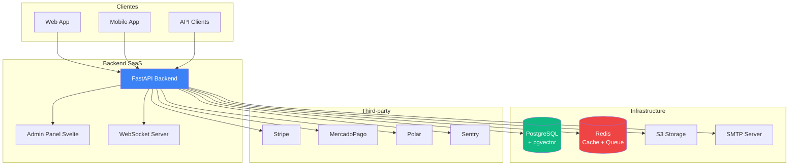

---

## 🔧 Stack Tecnológico

| Capa | Tecnología | Propósito |
|------|------------|-----------|
| **Runtime** | Python 3.13+ | Lenguaje base |
| **Framework** | FastAPI | Web framework async |
| **ORM** | SQLModel | Type-safe (Pydantic + SQLAlchemy) |
| **Database** | PostgreSQL 15+ | DB principal con pgvector |
| **Cache** | Redis 7+ | Cache, rate limiting, task queue |
| **Task Queue** | ARQ | Tareas async en background |
| **Storage** | S3-compatible | Archivos y media |
| **Migrations** | Alembic | Migraciones de schema |
| **Auth** | JWT + bcrypt | Tokens + password hashing |
| **Admin UI** | SvelteKit | Panel de administración |
| **Monitoring** | Prometheus + Grafana | Métricas y dashboards |
| **Error Tracking** | Sentry | Error reporting |
| **Testing** | pytest | 216 tests |

---

## 🏛️ Arquitectura de Alto Nivel

El backend sigue una arquitectura de **monolito modular** con separación clara de responsabilidades:

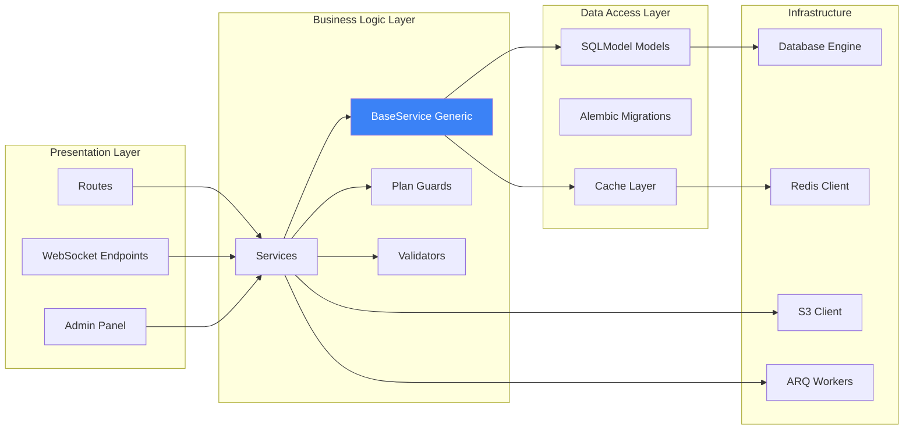

---

## 📚 Estructura de Capas

### Patrón: Routes → Services → Models

Todas las operaciones siguen el mismo flujo:

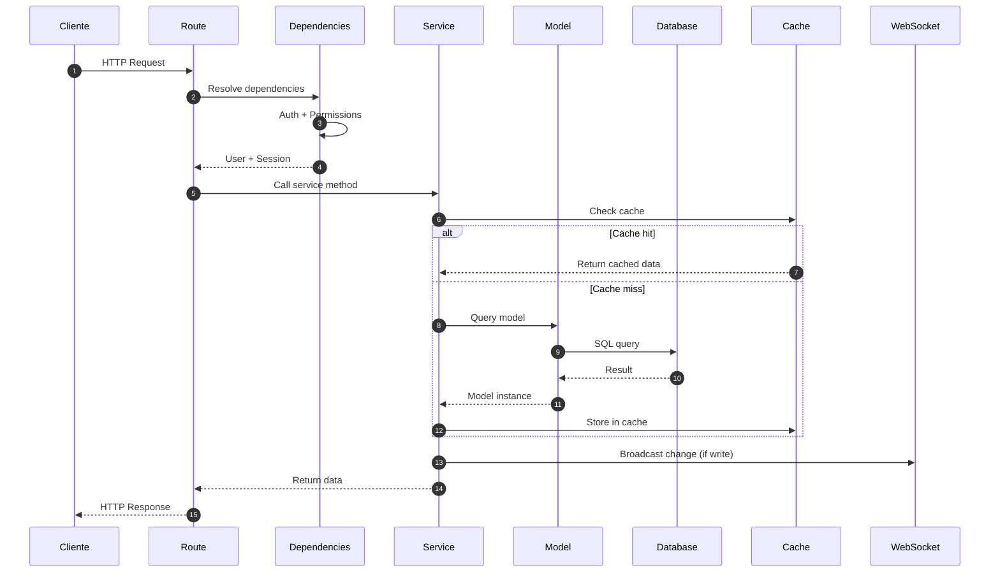

### BaseService Pattern

Todos los servicios heredan de `BaseService[Model, Create, Update, Read]`:

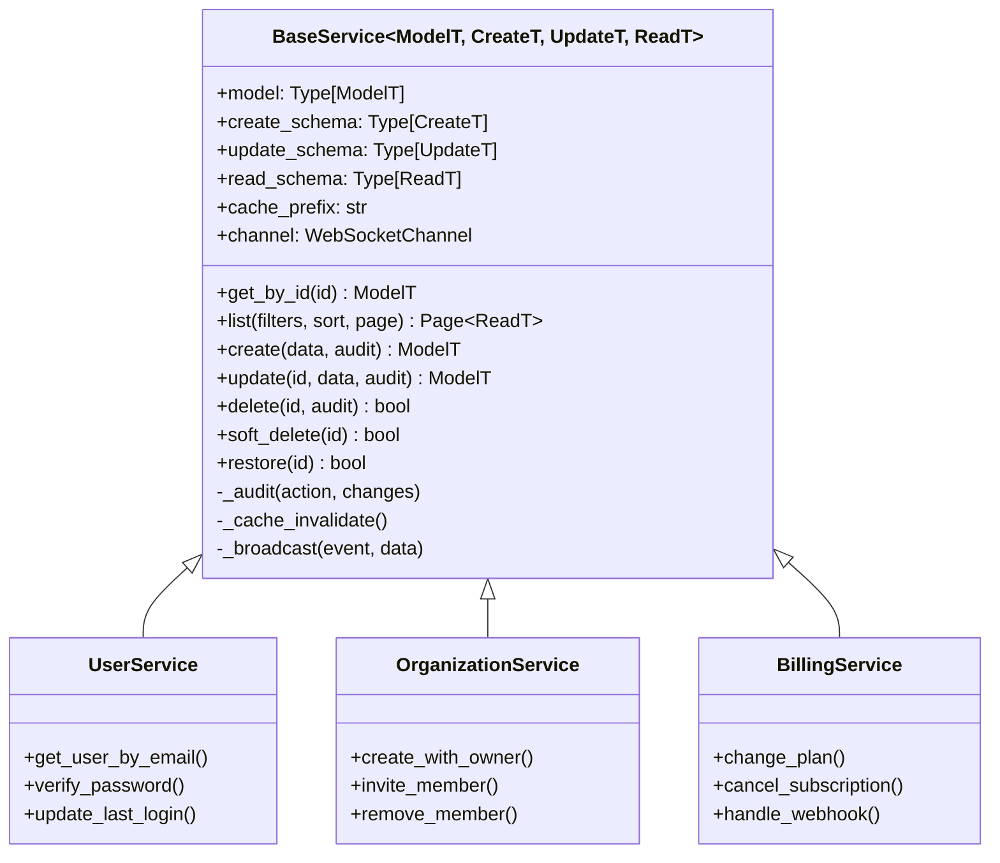

**Beneficios:**
- ✅ CRUD automático en todos los modelos
- ✅ Cache transparente (Redis)
- ✅ WebSocket broadcasting automático
- ✅ Audit log automático
- ✅ Soft delete integrado
- ✅ Filtros, sorting, paginación

---

## 🔐 Flujo de Autenticación

El sistema soporta **autenticación dual**: JWT tokens y API Keys.

### Flujo JWT (usuarios web)

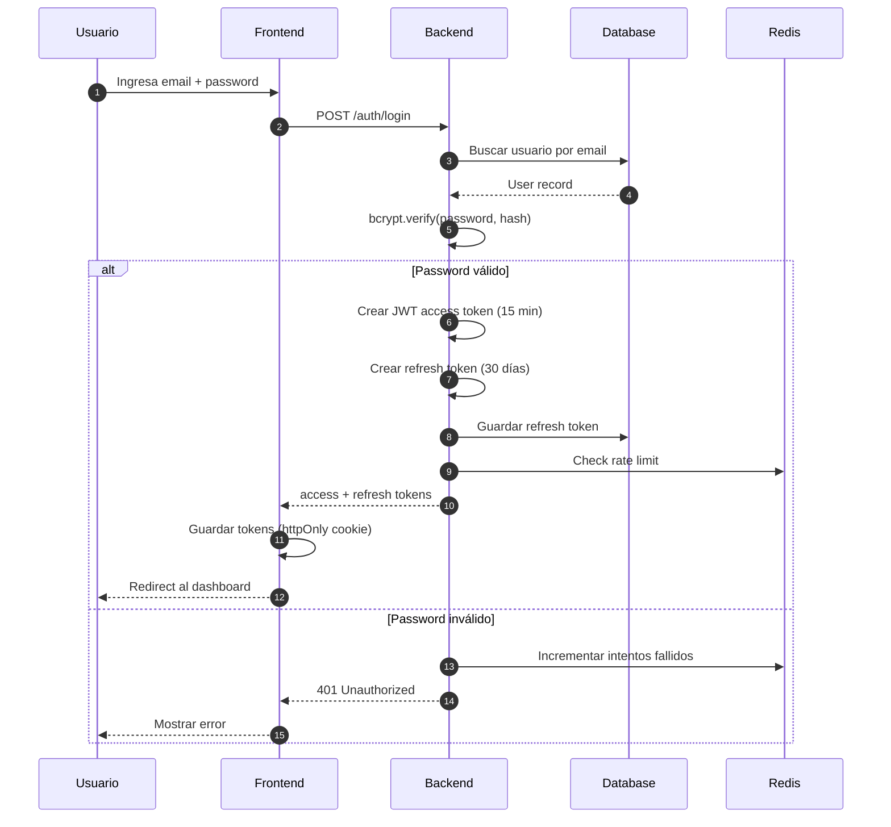

### Flujo API Key (integraciones)

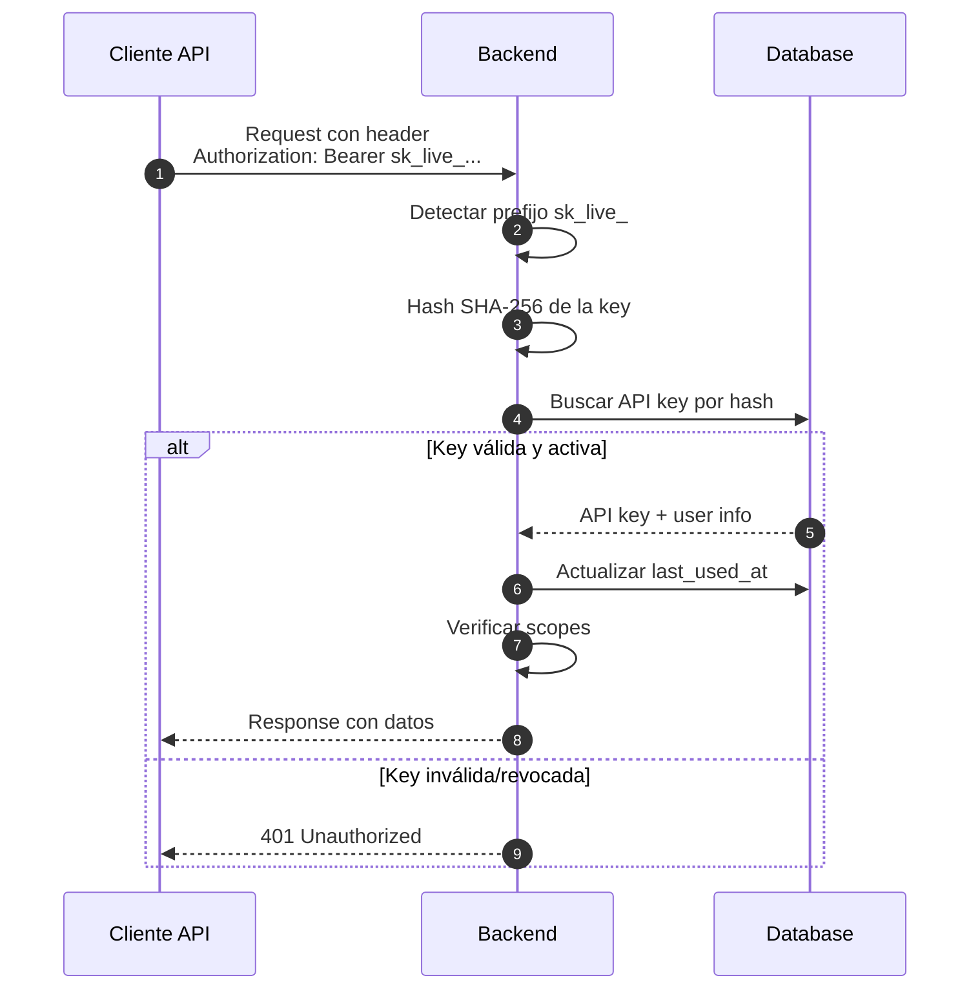

### Autenticación Dual en Dependency

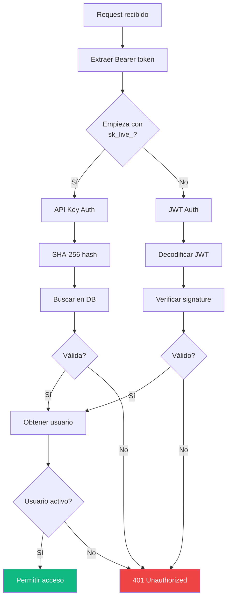

---

## 💾 Modelo de Datos

### Diagrama de Entidades Principal

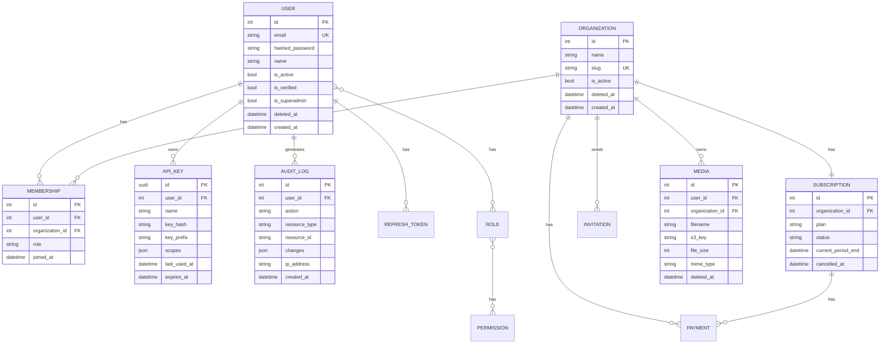

### Campos Comunes en Modelos

Todos los modelos incluyen campos base del `BaseModel`:

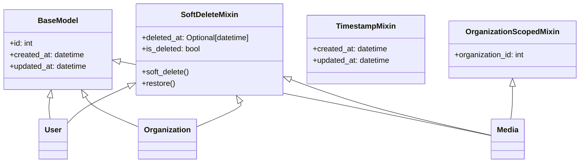

---

## 🏢 Multi-Tenancy

El sistema implementa multi-tenancy a nivel de aplicación con **aislamiento completo** entre organizaciones.

### Modelo de Aislamiento

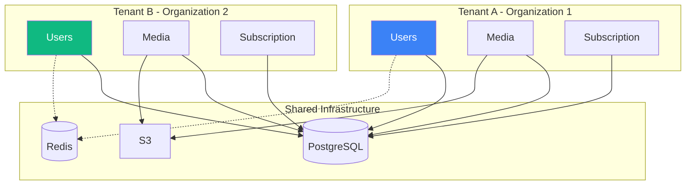

### Permisos y Roles (RBAC)

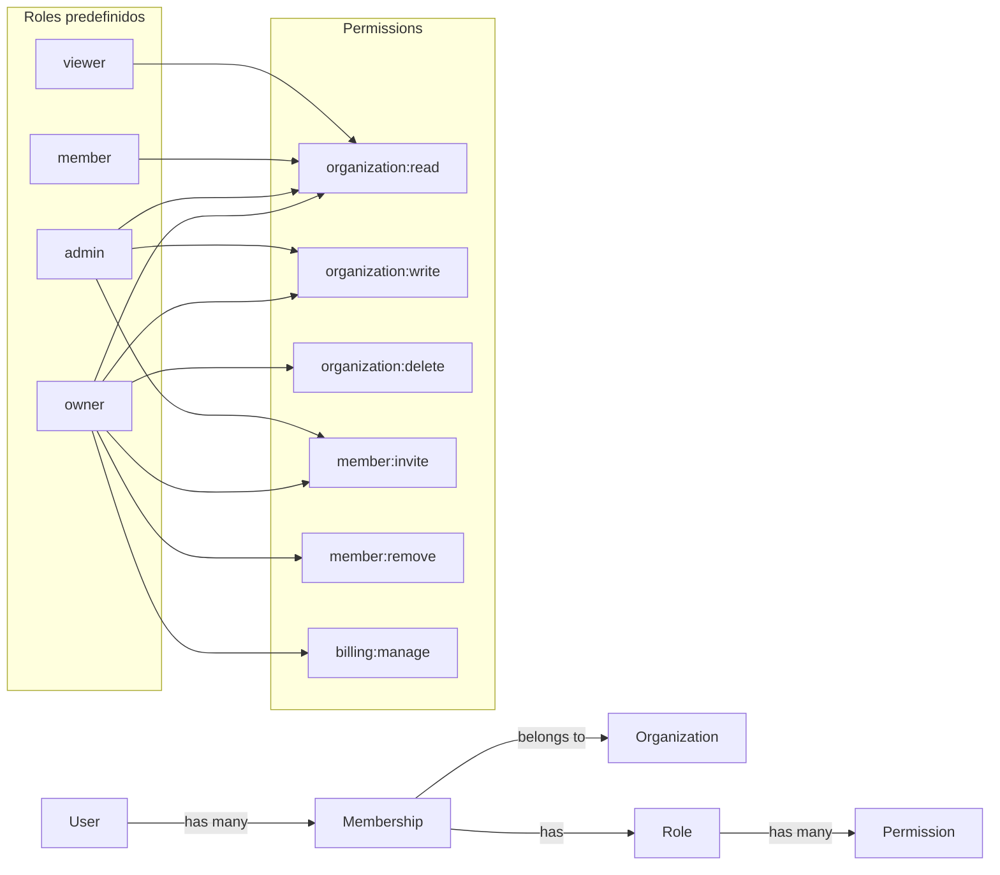

---

## 💳 Sistema de Billing

Soporta múltiples gateways con patrón Adapter:

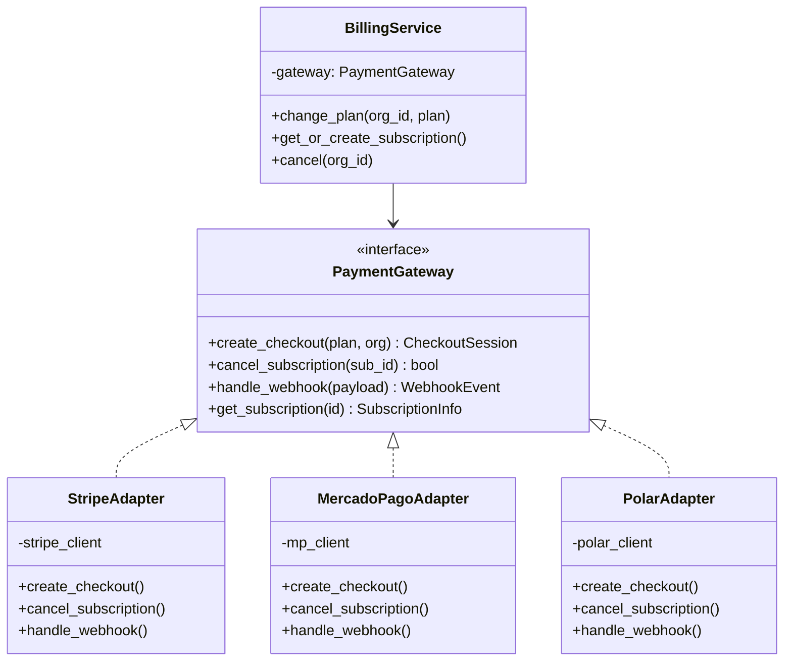

### Flujo de Cambio de Plan

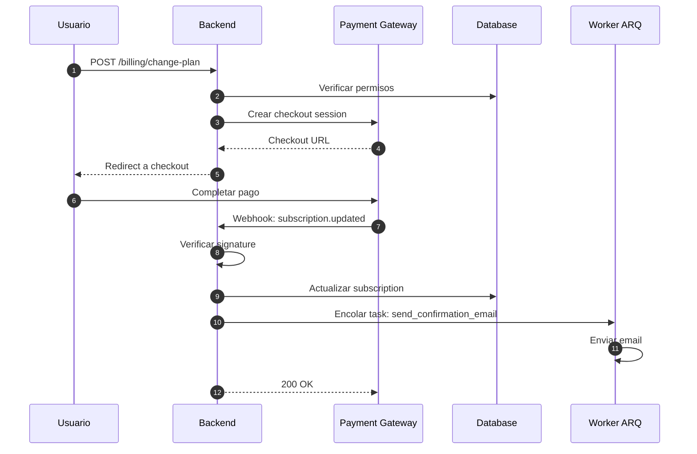

### Planes y Límites

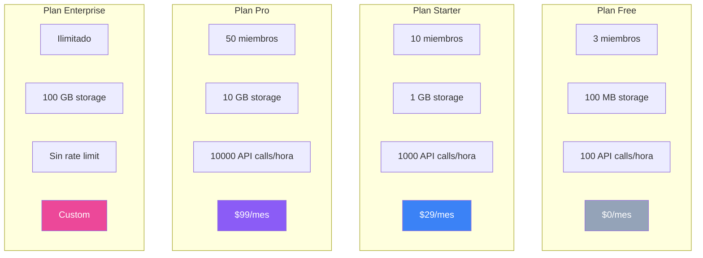

---

## 🔄 Pipeline de Middleware

Cada request pasa por una cadena de middlewares:

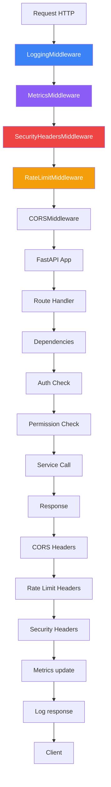

### Rate Limiting Per-Tenant

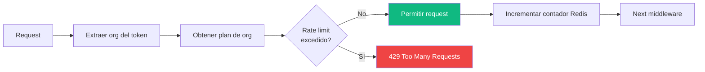

---

## 🔌 WebSockets y Broadcasting

Sistema de notificaciones en tiempo real usando canales por modelo:

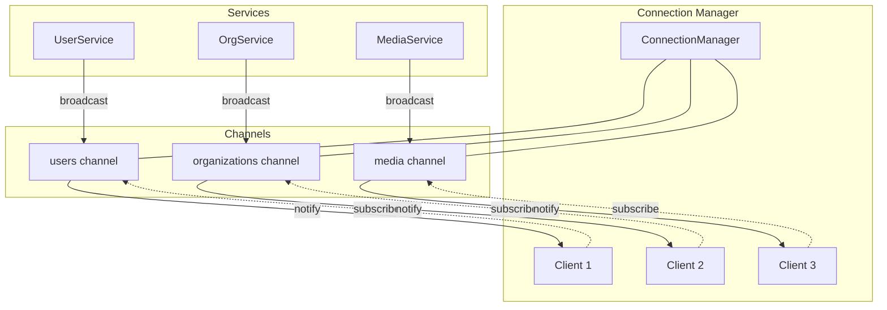

### Flujo de Broadcasting

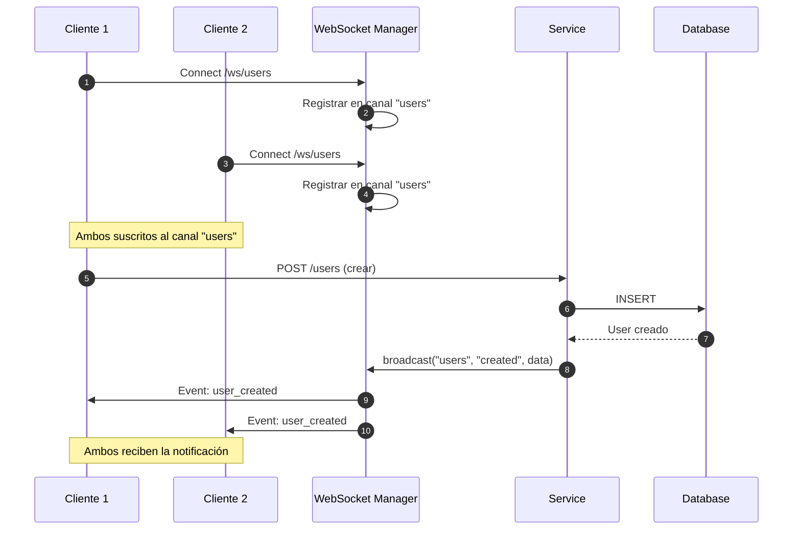

---

## ⚙️ Task Queue Asíncrona

ARQ workers procesan tareas en background:

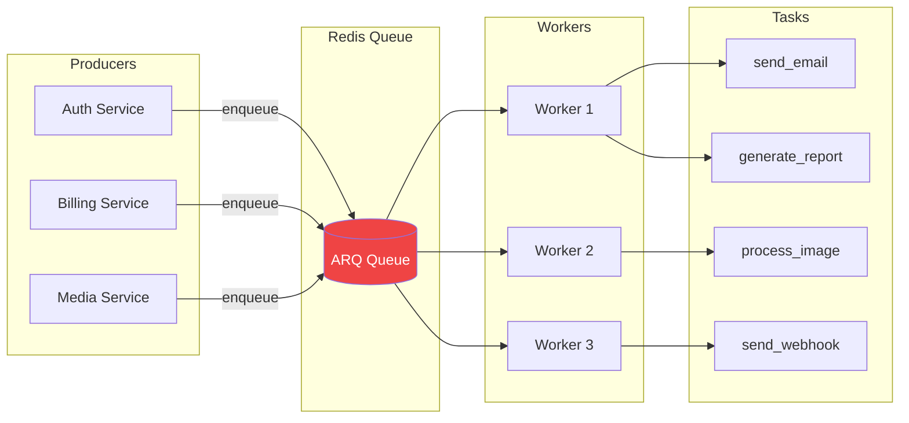

---

## 📁 Storage y Media

Abstracción sobre S3-compatible storage:

```mermaid
flowchart TD
    U[Usuario] -->|Upload file| R[/media/upload]
    R --> CHECK[Verificar plan limit]
    CHECK --> VALID{Tamaño OK?}
    VALID -->|No| ERR[402 Payment Required]
    VALID -->|Sí| UPLOAD[StorageService.upload]

    UPLOAD --> TYPE{Tipo de storage?}
    TYPE -->|USE_S3=true| S3[S3 Client]
    TYPE -->|USE_S3=false| LOCAL[Local Filesystem]

    S3 --> SAVE[Save to bucket]
    LOCAL --> SAVE2[Save to disk]

    SAVE --> META[Guardar metadata DB]
    SAVE2 --> META
    META --> URL[Generate presigned URL]
    URL --> RESP[Return Media object]

    style ERR fill:#ef4444,color:#fff
    style RESP fill:#10b981,color:#fff
```

### Storage Policies

```mermaid
graph TB
    M[Media Upload Request] --> CHECK[Check policies]

    CHECK --> SIZE{File size<br/>within limit?}
    CHECK --> QUOTA{Org quota<br/>available?}
    CHECK --> TYPE{MIME type<br/>allowed?}

    SIZE -->|Yes| PASS1[✓]
    QUOTA -->|Yes| PASS2[✓]
    TYPE -->|Yes| PASS3[✓]

    SIZE -->|No| FAIL1[✗ Too large]
    QUOTA -->|No| FAIL2[✗ Quota exceeded]
    TYPE -->|No| FAIL3[✗ Type not allowed]

    PASS1 & PASS2 & PASS3 --> UPLOAD[Upload OK]

    style UPLOAD fill:#10b981,color:#fff
    style FAIL1 fill:#ef4444,color:#fff
    style FAIL2 fill:#ef4444,color:#fff
    style FAIL3 fill:#ef4444,color:#fff
```

---

## 🚀 Deployment Architecture

### Producción con Docker Compose

```mermaid
graph TB
    subgraph "Load Balancer"
        LB[Nginx/Traefik]
    end

    subgraph "Application Tier"
        B1[Backend Instance 1]
        B2[Backend Instance 2]
        B3[Backend Instance 3]
    end

    subgraph "Worker Tier"
        W1[ARQ Worker 1]
        W2[ARQ Worker 2]
    end

    subgraph "Data Tier"
        DB_PRIMARY[(PostgreSQL<br/>Primary)]
        DB_REPLICA[(PostgreSQL<br/>Replica)]
        REDIS_PRIMARY[(Redis<br/>Primary)]
        REDIS_REPLICA[(Redis<br/>Replica)]
    end

    subgraph "Storage Tier"
        S3[(S3 Bucket)]
    end

    subgraph "Monitoring"
        PROM[Prometheus]
        GRAF[Grafana]
        SENTRY[Sentry]
    end

    CLIENT[Clients] --> LB
    LB --> B1
    LB --> B2
    LB --> B3

    B1 --> DB_PRIMARY
    B2 --> DB_PRIMARY
    B3 --> DB_PRIMARY

    B1 -.->|read| DB_REPLICA
    B2 -.->|read| DB_REPLICA
    B3 -.->|read| DB_REPLICA

    B1 --> REDIS_PRIMARY
    B2 --> REDIS_PRIMARY
    B3 --> REDIS_PRIMARY

    B1 --> S3
    B2 --> S3
    B3 --> S3

    REDIS_PRIMARY --> W1
    REDIS_PRIMARY --> W2

    B1 -.->|metrics| PROM
    B2 -.->|metrics| PROM
    B3 -.->|metrics| PROM

    PROM --> GRAF

    B1 -.->|errors| SENTRY
    B2 -.->|errors| SENTRY
    B3 -.->|errors| SENTRY

    DB_PRIMARY -.->|replica| DB_REPLICA
    REDIS_PRIMARY -.->|replica| REDIS_REPLICA

    style LB fill:#3b82f6,color:#fff
    style DB_PRIMARY fill:#10b981,color:#fff
    style REDIS_PRIMARY fill:#ef4444,color:#fff
    style S3 fill:#f59e0b,color:#fff
```

### Zero-Downtime Deployment

```mermaid
sequenceDiagram
    autonumber
    participant CI as CI/CD
    participant REG as Registry
    participant LB as Load Balancer
    participant B1 as Backend v1
    participant B2 as Backend v2
    participant HC as Health Check

    CI->>REG: Push nueva imagen
    CI->>B2: Iniciar nueva versión
    B2->>HC: Esperar health check
    HC-->>B2: Healthy
    CI->>LB: Agregar B2 al pool
    LB->>B2: Empezar a rutear tráfico
    CI->>LB: Drenar tráfico de B1
    LB->>B1: No más requests nuevos
    B1->>B1: Completar requests activos
    CI->>B1: Detener B1
    CI->>REG: Deployment completo

    Note over B1,B2: No downtime durante el switch
```

---

## 📊 Observabilidad

### Pipeline de Métricas

```mermaid
graph LR
    subgraph "Backend"
        M[MetricsMiddleware]
        E[/metrics endpoint]
    end

    subgraph "Collection"
        P[Prometheus]
    end

    subgraph "Visualization"
        G[Grafana]
        D1[Dashboard Requests]
        D2[Dashboard Errors]
        D3[Dashboard Performance]
    end

    subgraph "Alerting"
        A[Alertmanager]
        S[Slack]
        PD[PagerDuty]
    end

    M --> E
    E -->|scrape| P
    P --> G
    G --> D1
    G --> D2
    G --> D3
    P --> A
    A --> S
    A --> PD

    style P fill:#f59e0b,color:#fff
    style G fill:#3b82f6,color:#fff
```

### Health Checks

```mermaid
flowchart LR
    HC[/health] --> DB[Check DB]
    HC --> REDIS[Check Redis]
    HC --> S3[Check S3]
    HC --> SMTP[Check SMTP]

    DB --> S1{OK?}
    REDIS --> S2{OK?}
    S3 --> S3C{OK?}
    SMTP --> S4{OK?}

    S1 -->|Yes| R1[✓]
    S2 -->|Yes| R2[✓]
    S3C -->|Yes| R3[✓]
    S4 -->|Yes| R4[✓]

    S1 -->|No| F1[✗]
    S2 -->|No| F2[✗]
    S3C -->|No| F3[✗]
    S4 -->|No| F4[✗]

    R1 & R2 & R3 & R4 --> HEALTHY[200 OK]
    F1 --> UNHEALTHY[503 Unavailable]
    F2 --> UNHEALTHY
    F3 --> UNHEALTHY
    F4 --> UNHEALTHY

    style HEALTHY fill:#10b981,color:#fff
    style UNHEALTHY fill:#ef4444,color:#fff
```

---

## 📂 Estructura de Directorios

```
Seguros-BK/
├── app/
│   ├── config.py              # Settings (Pydantic)
│   ├── database/
│   │   └── connection.py      # SQLModel engine
│   ├── core/
│   │   ├── security.py        # JWT + bcrypt
│   │   ├── dependencies.py    # FastAPI dependencies
│   │   ├── permissions.py     # RBAC
│   │   └── plan_guards.py     # Plan limits
│   ├── models/                # SQLModel models
│   │   ├── user.py
│   │   ├── organization.py
│   │   ├── subscription.py
│   │   ├── api_key.py
│   │   ├── audit_log.py
│   │   └── media.py
│   ├── services/              # Business logic
│   │   ├── base_service.py    # Generic BaseService
│   │   ├── user_service.py
│   │   ├── organization_service.py
│   │   ├── billing/           # Payment adapters
│   │   ├── gdpr_service.py
│   │   └── websocket/         # WS manager
│   ├── routes/                # API endpoints
│   │   ├── auth.py
│   │   ├── users.py
│   │   ├── organizations.py
│   │   ├── billing.py
│   │   ├── gdpr.py
│   │   ├── admin.py
│   │   └── setup.py           # First-time setup
│   ├── middleware/            # Custom middleware
│   │   ├── logging.py
│   │   ├── metrics.py
│   │   ├── rate_limit.py
│   │   └── security_headers.py
│   ├── workers/               # ARQ workers
│   │   └── worker_config.py
│   └── utils/
├── admin-ui/                  # SvelteKit admin panel
│   ├── src/
│   │   ├── routes/
│   │   │   ├── +page.svelte         # Dashboard
│   │   │   ├── docs/+page.svelte    # Documentation
│   │   │   └── setup/+page.svelte   # Setup wizard
│   │   └── lib/
│   └── package.json
├── tests/                     # 216 tests
├── alembic/                   # Migrations
├── scripts/                   # Operations scripts
│   ├── backup.sh
│   ├── restore.sh
│   └── db-maintenance.sh
├── monitoring/
│   └── grafana-dashboard.json
├── docs/
│   ├── ARCHITECTURE.md        # Este archivo
│   ├── DEPLOYMENT.md          # Guía de deploy
│   └── OPERATIONS.md          # Operaciones
├── docker-compose.yml
├── Dockerfile
├── pyproject.toml
└── main.py                    # Entry point
```

---

## 🎓 Conceptos Clave para Nuevos Desarrolladores

### 1. **¿Por qué monolito modular en vez de microservicios?**
- Más simple de desarrollar y desplegar
- Mejor para equipos pequeños/medianos
- Fácil refactor a microservicios cuando sea necesario
- Menos complejidad operacional

### 2. **¿Por qué SQLModel en vez de SQLAlchemy puro?**
- Type-safety con Pydantic
- Menos boilerplate (modelos unificados)
- Mejor integración con FastAPI
- Auto-completado en IDEs

### 3. **¿Por qué BaseService genérico?**
- DRY: evita repetir CRUD en cada servicio
- Features transversales (cache, audit, WebSocket) automáticas
- Facilita agregar nuevos modelos
- Type-safety con genéricos

### 4. **¿Por qué Redis para rate limiting?**
- Atómico (INCR + EXPIRE)
- Persistente a nivel de servidor
- Compartido entre instancias (horizontal scaling)
- Fast (in-memory)

### 5. **¿Por qué ARQ en vez de Celery?**
- Nativo async/await (integra bien con FastAPI)
- Menos dependencias
- API más simple
- Suficiente para la mayoría de casos

---

## 🔗 Enlaces Relacionados

- [DEPLOYMENT.md](./DEPLOYMENT.md) - Guía completa de deployment
- [OPERATIONS.md](./OPERATIONS.md) - Operaciones y mantenimiento
- [API Docs](http://localhost:8000/docs) - Swagger UI
- [Admin Docs](http://localhost:8000/admin/docs) - Documentación en admin panel

---

## 📝 Notas Finales

Este backend está diseñado para ser un **template reutilizable**. Al iniciar un nuevo proyecto SaaS:

1. Clonar el repositorio
2. Ejecutar el **Setup Wizard** visual (`/setup`) para configurar variables
3. Personalizar modelos según el dominio del proyecto
4. Agregar nuevas rutas y servicios siguiendo el patrón establecido
5. Los tests, seguridad, monitoring y observability ya están incluidos

**El código está listo para producción desde el día 1.**
